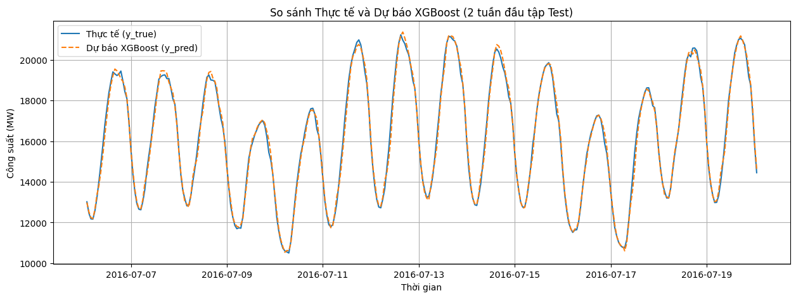

# Multivariate Time Series Forecasting

## 1. Giới thiệu
- Tên sinh viên: Nguyễn Minh Nhật
- Bài toán: Dự báo chuỗi thời gian nhiều chiều. Đầu vào là ma trận X, đầu ra là y.

## 2. Literature Review
Chi tiết tóm tắt 3 bài báo nghiên cứu được lưu tại thư mục papers/:
1. iTransformer: Inverted Transformers Are Effective for Time Series Forecasting.
2. TimeMixer: Decomposable Multiscale Mixing for Time Series Forecasting.
3. xLSTM-Mixer: Multivariate Time Series Forecasting by Mixing via Scalar Memories.

## 3. Quá trình triển khai
- Dữ liệu và phân tích EDA: Xem tại notebooks/01_data_exploration.ipynb
- Xây dựng đặc trưng (Fourier, Lags): Xem tại notebooks/02_feature_engineering.ipynb
- Huấn luyện:
  - Baseline (Moving Average / Linear Regression)
  - Mô hình học máy mùa vụ (XGBoost)
  - Mô hình Deep Learning nâng cao

## 4. Kết quả Đánh giá

| Mô hình | MAE | RMSE | MAPE (%) |
| :--- | :--- | :--- | :--- |
| Baseline (Lag 24h) | 1391.22 | 1878.71 | 9.38 |
| XGBoost (Fourier) | 512.63 | 733.91 | 3.52 |

## 5. Biểu đồ Dự báo
Dưới đây là kết quả dự báo của mô hình XGBoost so với giá trị thực tế trên 2 tuần đầu của tập Test:

## 6. Hướng dẫn chạy code
Cài đặt các thư viện cần thiết bằng lệnh:
pip install -r requirements.txt
