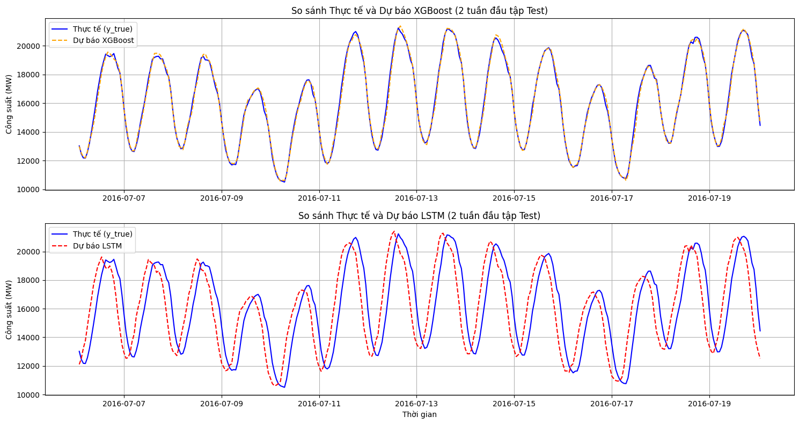

# Multivariate Time Series Forecasting

## 1. Giới thiệu
- **Sinh viên thực hiện:** Nguyễn Minh Nhật
- **Bài toán:** Dự báo chuỗi thời gian nhiều chiều (Multivariate Time Series). Đầu vào là ma trận đặc trưng không gian - thời gian $X$, đầu ra là biến mục tiêu $y$ (Công suất phụ tải điện).

## 2. Cấu trúc Dự án & Quá trình Triển khai
Dự án được module hóa thành 4 giai đoạn nối tiếp nhau, tuân thủ nguyên tắc Pipeline và sử dụng Google Drive làm trung gian lưu trữ dữ liệu để tối ưu hóa bộ nhớ:
- `notebooks/01_data_exploration.ipynb`: Tiền xử lý, nội suy khuyết thiếu và phân tích phổ Fourier (EDA).
- `notebooks/02_feature_engineering.ipynb`: Trích xuất đặc trưng Lags và các hàm cơ sở lượng giác (Fourier basis) chu kỳ ngày/tuần.
- `notebooks/03_models.ipynb`: Võ đài huấn luyện 3 kiến trúc: Baseline (Naive), XGBoost (Machine Learning) và LSTM (Deep Learning).
- `notebooks/04_evaluation.ipynb`: Tính toán ma trận sai số (MAE, RMSE, MAPE) và xuất biểu đồ so sánh.

## 3. Hướng dẫn Tái hiện Kết quả (Reproducibility)
Dự án hỗ trợ 2 phương pháp để người xem tái hiện mã nguồn và kiểm chứng kết quả:

**Cách 1: Xem nhanh kết quả (Không cần tốn thời gian huấn luyện)**
Người chấm không cần chạy lại các mô hình tính toán nặng.
1. Mở file `notebooks/04_evaluation.ipynb` trên Google Colab.
2. Dữ liệu dự báo của cả 3 mô hình đã được hệ thống đóng gói và chia sẻ công khai qua một tệp `.csv` độc lập.
3. Chỉ cần bấm **Run all** trên file `04`. Hệ thống sẽ tự tải kết quả về, in bảng Metrics và vẽ đồ thị trực quan ngay lập tức.

**Cách 2: Huấn luyện lại từ đầu (Training from scratch)**
1. Cấu hình Google Drive cá nhân trên Colab.
2. Mở và chạy tuần tự từ file `01` $\rightarrow$ `02` $\rightarrow$ `03` $\rightarrow$ `04`. Cho phép (Allow) kết nối Drive khi Colab yêu cầu để các file truyền kết quả trung gian cho nhau một cách tự động.

## 4. Kết quả Đánh giá
*(Các chỉ số chi tiết được trích xuất từ tập kiểm thử độc lập Test Set)*

| Mô hình | MAE (MW) | RMSE (MW) | MAPE (%) |
| :--- | :--- | :--- | :--- |
| **Baseline (Lag 24h)** | (Điền số) | (Điền số) | (Điền số) |
| **XGBoost (Fourier & Lags)** | (Điền số) | (Điền số) | (Điền số) |
| **LSTM (Deep Learning)** | (Điền số) | (Điền số) | (Điền số) |

## 5. Biểu đồ Dự báo
Dưới đây là kết quả dự báo của 2 kiến trúc mạng nâng cao so với đường thực tế trên tập Test:



## 6. Literature Review
Chi tiết tóm tắt lý thuyết của 3 kiến trúc mạng SOTA (State-of-the-Art) được lưu trữ tại thư mục `papers/`:
1. `iTransformer`: Inverted Transformers Are Effective for Time Series Forecasting.
2. `TimeMixer`: Decomposable Multiscale Mixing for Time Series Forecasting.
3. `xLSTM-Mixer`: Multivariate Time Series Forecasting by Mixing via Scalar Memories.

## 7. Cài đặt môi trường
Cài đặt các thư viện phụ thuộc bằng lệnh:
```bash
pip install -r requirements.txt
